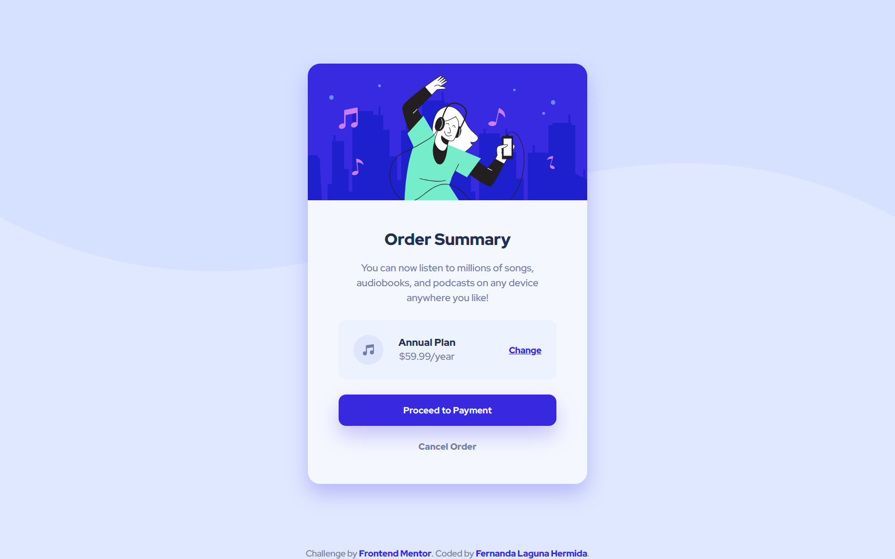

# Frontend Mentor - Order summary card solution

This is a solution to the [Order summary card challenge on Frontend Mentor](https://www.frontendmentor.io/challenges/order-summary-component-QlPmajDUj). Frontend Mentor challenges help you improve your coding skills by building realistic projects. 

## Table of contents

- [Overview](#overview)
  - [The challenge](#the-challenge)
  - [Screenshot](#screenshot)
  - [Links](#links)
- [My process](#my-process)
  - [Built with](#built-with)
  - [What I learned](#what-i-learned)
  - [Continued development](#continued-development)
  - [Useful resources](#useful-resources)
- [Author](#author)

## Overview

A responsive card component for an order preview.

### The challenge

Users should be able to:

- See hover states for interactive elements

### Screenshot




### Links

- Solution URL: 
- Live Site URL: https://ferlagher.github.io/FMC-Order-summary-component

## My process

I challenge myself to build this solution without using breakpoints. I started learning Sass a few day ago, so I wanted to try out the functions. I only use one media query for changing the background image. The other elements use a `clamp()` function to scale according to the viewport size. The `min()` function inside `clapm()` makes the card `width:100%` only in small devices.

### Built with

- Semantic HTML5 markup
- Sass ♥
- Flexbox
- CSS Grid

### What I learned

I really love Sass, everyday I learn something new.
Today I learned how to use some usefull CSS functions.

```scss
$width-card: clamp(min(100%, 327px), 33vw, 450px);
```

### Continued development

I want to try out more complex Sass functions and loops.

Next challenge: [Stats preview card component](https://www.frontendmentor.io/challenges/stats-preview-card-component-8JqbgoU62)

### Useful resources

- [The Surprising Truth About Pixels and Accessibility](https://www.joshwcomeau.com/css/surprising-truth-about-pixels-and-accessibility/#the-625-trick)
- [clamp()](https://developer.mozilla.org/en-US/docs/Web/CSS/clamp)

## Author

- LinkedIn - [ferlagher](https://www.linkedin.com/in/ferlagher/)
- Frontend Mentor - [@ferlagher](https://www.frontendmentor.io/profile/ferlagher)
- Instagram - [@ferlagher](https://www.instagram.com/ferlagher/)

Thank you very much for reading. ♥
